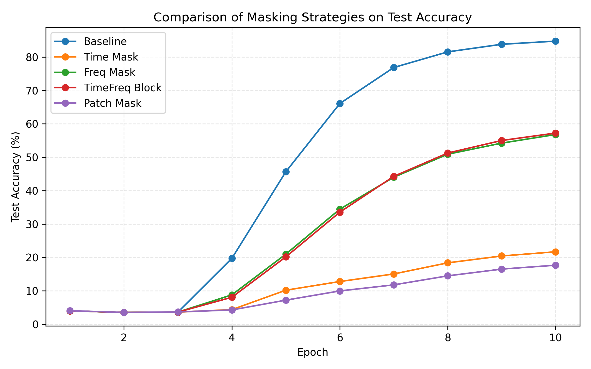

# Audio-MAE: Masking Strategies for Supervised Audio Learning Audio-MAE：音訊遮罩策略於監督式學習中的應用

## Group Member
第17組

吳俊廷 M144020002 (資管系碩一 康藝晃老師Lab，產學計畫：日月光、聯電計畫)

莊雅筑 M144020003 (資管系碩一 羅珮綺老師Lab)

張詠晴 M144020064 (資管系碩一 康藝晃老師Lab，產學計畫：日月光、聯電計畫)


## Introduction
本專案以《Masked Autoencoders that Listen》[1] 為基礎，將遮罩觀念延伸至音訊分類任務（Fine-tuning），探討不同遮罩方式作為 Fine-tuning 階段的資料增強策略，並比較其對模型結果的影響。
以下為我們預期的實作步驟：
1. 依照原論文實作 Baseline Audio-MAE，使用 Speech Commands V2 資料集 [4] 進行訓練，以建立可靠的比較基準。
2. 我們設計四種聲譜圖遮罩方式，分別為：
    - 時間遮罩（Time Masking）
    - 頻率遮罩（Frequency Masking）
    - 時頻區塊遮罩（Time-Frequency Block Masking）
    - 隨機 Patch 遮罩（MAE-style Random Patch Masking）

四種遮罩方式均以統一的資料流程與程式架構實作，我們預期這些不同遮罩策略將對音訊分類模型能力造成不同程度的影響，並將在後續結果中分析遮罩與模型的型表現之間的關係。


## Findings
我們發現雖然遮罩在Pre-Train階段能提升模型學習特徵的成效，但在音訊分類任務中卻無法提升準確率，反而有更差的結果。




## Demo
本實作的 Source Code 來自於《Masked Autoencoders that Listen》[1]

1. 請參考《Masked Autoencoders that Listen》Source Code [5] 中的說明建立環境。
   [MAE repo](https://github.com/facebookresearch/mae)
2. Baseline on Speech Commands V2：
```
bash run_sc.sh
```
3. Masking Strategy
    - 時間遮罩（Time Masking）
    ```
    bash run_sc_time.sh
    ```
    - 頻率遮罩（Frequency Masking）
    ```
    bash run_sc_freq.sh
    ```
    - 時頻區塊遮罩（Time-Frequency Block Masking）
    ```
    bash run_sc_timefreq.sh
    ```
    - 隨機 Patch 遮罩（MAE-style Random Patch Masking）
    ```
    bash run_sc_random_patches.sh
    ```
4. Plot for Evaluation
    - 訓練過程中Loss與Accuracy的變化
    ```
    python plot_results.py
    ```
    - 不同遮罩策略Accuracy的比較
    ```
    python plot_compare_masks.py
    ```  

## References
文獻引用：
[1] Huang, P.-Y. et al. “Masked Autoencoders that Listen,” NeurIPS 2022.

[2] He, K. et al. “Masked Autoencoders are Scalable Vision Learners,” CVPR 2022.

[3] https://github.com/pengzhiliang/MAE-pytorch?tab=readme-ov-file#

資料：
[4] SpeechCommands V2 Dataset - YuanGongND

Source Code：
[5] https://github.com/facebookresearch/AudioMAE
